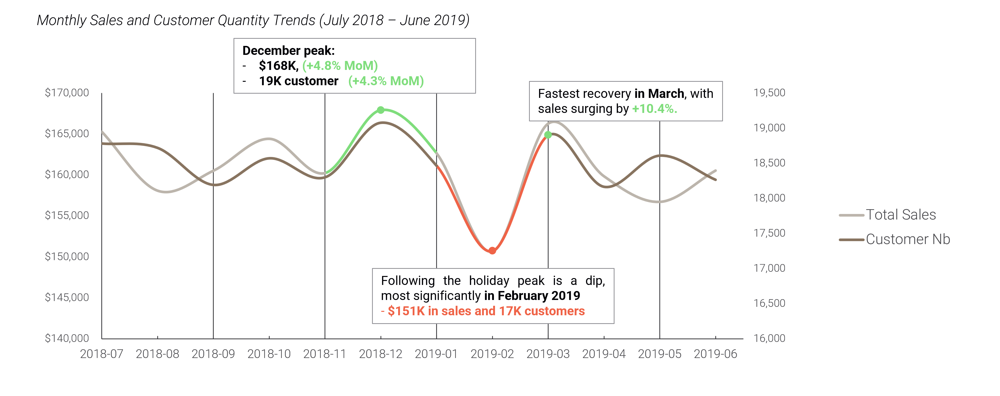

# **GetMart Retail Strategy: Chip Category Analysis**
_**Author**: Thu Pham | **Date**: 06/2025_

## *Table of Contents*

1. [Project Background](#1-project-background)  
2. [Data Structure & Initial Checks](#2-data-structure--initial-checks)  
3. [Executive Summary](#3-executive-summary)  
4. [Insights Deep Dive](#4-insights-deep-dive)  
5. [Recommendations](#5-recommendations) 
6. [Assuptions & Caveats](#6-assumptions--caveats)

## _**1. Project Backround**_

    This repository presents an independent, hypothetical data analysis project inspired by the Quantium Data Analyst virtual experience on Forage.

This project provides a strategic analysis for our client, **GetMart**, a mid-sized supermarket chain known for its focus on providing value to local communities. In preparation for the upcoming fiscal year, the GetMart Chip Category Manager requires a data-driven strategy to increase sales and better understand their customer base.

This analysis uses **12 months of transactional data to uncover key insights**. The core of the analysis focuses on customer segmentation and an A/B test evaluation, measured through key business metrics including _**Total Sales, Number of Customers, Number of Transactions, and Average Transaction Value**_. The goal is to identify high-value customer segments and validate strategic initiatives that can be implemented to drive growth in the chip category.

The analysis is broken down into two main components:

1. **Customer Analytics:** A deep dive into customer purchasing patterns to identify high-value segments.

2. **A/B Test Trial Assessment:** A statistical evaluation of a three-month trial involving a new store layout to measure its impact on sales and customer traffic.

The presentation report for stakeholder review is available here. [link](Documents\Retail_analysis_Report.pdf)

The Python code used to inspect and clean the data for this analysis can be found here [link](Data_cleaning.ipynb).

The Python code used to conduct deep-dive analysis on customer segmentations can be found here [link](EDA_SegmentAnalysis.ipynb).

The Python code used to conduct the A/B Store Trial assessment can be found here [link](Trial_assessment.ipynb).

## _**2. Data Structure and Initial Check**_
The analysis is based on two primary datasets provided by GetMart,`transaction_data`, `purchase_behaviour`, which were then used to create a third, normalized product table. A description of each table is as follows:

- **`transaction_data`:** This is a large dataset with over _**264,000 rows**_, where each row represents a chip purchase transaction. It covers the period _**from July 2018 to June 2019**_ and includes details for each unique transaction (`TXN_ID`), such as the quantity and value of chips purchased, and the customer's loyalty card ID.

- **`purchase_behaviour` / `customer_table`**: This table contains demographic information for _**over 75,000 unique loyalty card members**_. It categorizes each customer by their affluence (`PREMIUM_CUSTOMER`) and assigns them to one of seven distinct `LIFESTAGE` segments (e.g., 'Retirees', 'Young Families').

- **Product Dimension Table - `product_info`**: To enable brand and packaging analysis, a new product dimension table was created. This table normalizes the _**114 unique chip products**_ by extracting and cleaning their `BRAND` (21 unique brands) and `PACK_SIZE` (21 unique sizes), linking them to their original product number (`PROD_NBR`).

## _**3. Executive Summary**_

The core recommendation is to **implement a dual-strategy focusing on two keys, high-value customer segments: Budget Older Families and Mainstream Young Singles/Couples**.

- **Customer Insights**: The analysis revealed that sales growth is driven by purchase frequency, not spend per visit, as all segments spend a similar amount per transaction. We identified two key customer personas with distinct preferences: **Budget - Older Families**, who are a high-value segment preferring mainstream value brands, and **Mainstream - Young Singles/Couples**, a large segment representing a growth opportunity with a strong affinity for popular, flavor-focused brands.

- **Trial Validation**: A three-month in-store trial, which moved the chip category to a prominent end-cap, was a success. It **drove a statistically significant increase in both sales and customer traffic** in _two of the three trial stores_, validating that strategic changes to store layout can effectively boost performance.

## _**4. Insights and Deepdive**_
### **4.1. Customer Analytics: Who Are Our Most Valuable Segments?**
A deep dive into customer purchasing patterns revealed that the chip category is a mature market driven by specific, high-value customer segments with distinct brand preferences.
#### 4.1.1. Overall Market trend
An analysis of sales over the 12-month period shows a stable market with predictable seasonality. 
- Sales consistently _**peak in December**_, driven by the holidays, and experience a significant dip in the post-holiday period. 
-  A key observation is the near-perfect correlation between monthly total sales and the number of customers, indicating that the primary driver of sales is customer traffic. 
    - With the _exception in August 2018 and May 2019_ when the customer quantiy and sales have opposite trends. Sales had seen a decline while shoppers had incresed.
    - Possible reasons include : _discouting and promotions, a shift in product mix to cheaper items_.
- This indicates that growth in this category must be strategically driven rather than relying on organic market trends.

#### 4.1.2. Identifying High-Value Customer Segments:

_**Insights from Monthly Trends by Customer Affluence (from July 2018 - June 2019):**_ 
- **Mainstream (~751K - 39%) and Budget Segments (~676K - 35.0%)** drive the Bulk of Sales, while **Premium Customers Contribute the Least (~506K - 26%)**.
- Customer Quantity Aligns with Sales Rank: The number of customers for each segment (the bars) directly corresponds to their sales performance. The Mainstream group consistently has the highest number of customers, followed by Budget, and then Premium.
- **All Segments Follow the Same Seasonal Pattern:** All three affluence segments exhibit the same seasonal trends, with a clear sales **peak in December** and a corresponding **dip in February**. 

_**Performance by Customer Affluence:**_ The data reveals that sales contribution is a direct function of the size and frequency of the customer group.
- **Mainstream customers drive the most sales (38.8%)** simply because they form the largest **customer base (40.3%)**
- **Budget customers** are the most frequent shoppers, with the highest average transactions per customer (3.78).
- Crucially, **the average transaction value is nearly identical** across all segments ($7.31 - $7.41), proving that no single group is inherently a "bigger spender" per trip.

_**Identifying High-Value Personas:**_ Combining affluence with lifestage reveals our key target segments. By comparing a segment's size to its sales contribution, we can pinpoint who our most valuable customers are.

- **High-Value Performers (`Budget - Older Families`)**: This segment is the most valuable relative to its size, **contributing 18.2% of sales from only 13.5% of the customer base**. They are *high-volume, value-conscious shoppers* with a strong affinity for mainstream value brands like RRD and Smiths.

- **High-Potential Growth Segment (`Mainstream - Young Singles/Couples`)**: This is the *single largest segment* in our customer base **(11.1%)**. While their sales contribution is strong **(8.15%)**, their large size presents a significant opportunity for growth.

- **Stable Core Customers (`Retirees` and `Older Singles/Couples`)**: These two older, non-family lifestages form the stable core of the chip category, *making up a massive 40% of the customer base* and contributing a proportional *40% of total sales*. Their brand preferences are generally mainstream and consistent.

- **Under-Performing Segments (`New Families` and `Mid-aged Singles/Couples`)**: These groups are the least engaged. `New Families`, in particular, make up only **3.5% of the customer base and contribute just 2.6% of sales**, indicating a significant gap in the current product offering for this demographic. 

#### **4.1.3. Brand Affinity of Key Segments:**
- **`Budget - Older Families` prefer Value and Family Brands**: This segment significantly over-indexes on brands like _**RRD (25% more likely), Woolworths (22% more likely), and Smiths (12% more likely)**_.
- **`Mainstream - Younger Singles/Couples`** audiences lean toward popular, market-leading brand such as Kettle or **Doritos (12% more likely)** and they are willing to pay more for their chips.
- **The 175g and 150g pack sizes are the most popular** across all customer segments, collectively accounting for nearly **40% of total sales**.

### **4.2. Trial Store Analysis: Validating the Strategy**

To test if strategic changes could drive growth, a three-month trial was conducted to measure the impact of increased product visibility by _**relocating the chip category to a prominent aisle end-cap**_ in **three trial stores (77, 86, and 88)**.

#### 4.2.1. Trial Methodology
To ensure a fair assessment, a unique control store was selected for each trial store based on its high similarity in pre-trial performance across monthly total sales and monthly customer count. 

The assessment of the trial's success was determined through a two-step statistical method:

1. **Scaling and Percentage Difference:** A scaling factor was applied to the control store's data to create a normalized baseline. Each month, the trial store's performance was compared to a scaled control baseline derived from pre-trial data.

2. **Significance Testing:** Monthly t-statistics were computed using pre-trial standard deviations, with uplifts deemed significant if they exceeded the 95% confidence threshold.

#### 4.2.2. Trial Results 

| Trial Store | Control Store | Result            | Sales Performance                                                                                      | Customer Traffic                                                                                           | Conclusion                                                                                                                       |
|-----------|--------------|-------------------|---------------------------------------------------------------------------------------------------------|-------------------------------------------------------------------------------------------------------------|----------------------------------------------------------------------------------------------------------------------------------|
| **77**          | **233**            | **Successful Uplift** | Up to **+24.7% uplift in March and +56% in April** compared to scaled control store.                              | Up to **+24.7%** growth in customer numbers—strong attraction to the new placement.                         | Significant growth in **both sales and traffic**—a clear success.                                                                |
| **88**          | **237**            | **Successful Uplift** | Up to **+22.1% uplift in March and +19.3% in April** vs. expected baseline.                              | Over **+13.3%** increase in March—placement effectively drew more traffic.                                  | Successfully boosted **sales revenue and customer numbers**.                                                                    |
| **86**          | **155**            | **Mixed Results**     | Inconsistent uplift—March spike noted **(+31.6%)**, but overall increase not statistically significant.              | Up to **+22.3%** growth in customer traffic throughout the period.                                          | Traffic did not consistently convert to sales—suggests other factors like **demographics/product mix** impacted performance.     |

#### 4.2.3. Results Analysis
- The performance during the trial aligned with the dip in the overall market. _**The strong outperformance in the successful trial stores during March and April confirms a positive trial effect**_ beyond normal seasonal trends.
- The prominent end-cap placement (in stores 77 and 88) likely captured _**high-intent impulse purchases**_ and increased the visibility of the entire chip category for regular shoppers, leading to higher sales and traffic.
- _**The divergence in Store 86**_ could be due to several factors: a different customer demographic mix that is less responsive to impulse buys, the specific product assortment in that store not aligning with the impulse-driven customer, or local competition and other in-store factors.

## _**5. Recommendations**_
### _**5.1. A dual-strategy focusing on our two most valuable customer segments:** `Budget Older Families` and `Mainstream - Young Singles/Couples`._
Chip sales exhibit stable seasonal trends, with all customer segments spending an average of $7.30 per transaction. To capitalize on this consistency:
- Drive more store traffic by promoting seasonal chip deals.
- Encourage chip purchases within trips by optimizing in-store placement, cross-promotions (e.g., with beverages or dips), or targeted loyalty incentives.

Customer Segment Insights & Actionable Recommendation:

**`Budget – Older Families`** - Strong performers in volume; favor value-centric brands like RRD and Smiths:
- Promote multi-buy and bundle deals to grow basket size.
- Position top value brands at high-visibility zones (e.g., aisle end-caps).

**`Mainstream – Young Singles/Couples`** - Large, influential segment; brand-aware and flavor-driven (e.g., Kettle, Doritos, Tyrrells).
- Launch youth-targeted digital campaigns and in-store tastings.
- Leverage secondary placements in “discovery” areas to spark impulse purchases.

**`Mainstream – Retirees`** - Strong in both sales and demographic representation.
- Maintain relevance through classic flavors and trusted brands.
- Highlight nutritional benefits or portion control for aging shoppers.

**`Mid-Segment – Older Singles/Couples`** - Moderate performance; opportunity to deepen engagement.
- Test messaging around indulgence, nostalgia, or convenience.
- Explore cross-category promotions with easy meal accompaniments.

**Underperforming – `Mid-Aged Singles & New Families`** currently lagging behind in sales contribution.
- Investigate barriers via behavioral analysis and targeted surveys.
- Identify assortment gaps or lifestyle mismatches through basket analysis.

### _**5.2. Aisle Adjustment Trial Yields Positive Results — Time to Scale**_
- _**Phased Rollout:**_ Implement a phased rollout of the end-cap placement, starting with stores that have similar customer profiles to the successful trial locations, then expand based on performance.
- _**Strategic Analysis:**_ Conduct a deep-dive analysis on Store 86, focusing on customer journey, basket analysis, and product mix to understand its unique result and refine the strategy for similar stores.
- _**Future Optimization:**_ Launch a "Trial 2.0" combining the successful new layout with the targeted brand promotions we identified to measure their combined impact and further boost sales.

## _**6. Assumptions & Caveats**_
The following assumptions and limitations should be considered when interpreting the results:
- **Data Integrity:** The analysis assumes that the provided transaction and customer data is accurate and complete for the 12-month period from July 2018 to June 2019.
- **Exclusion of Wholesale Transactions:** To focus on typical retail customer behavior, two large outlier transactions (over $600) were identified and removed from the dataset, as they were assumed to be wholesale.
- **Customer Demographics:** The analysis relies on the `LIFESTAGE` and `PREMIUM_CUSTOMER` fields being accurate representations of a customer's household status and overall spending habits.
- **External Factors:** The conclusions do not account for external factors that could influence purchasing behavior, such as competitor promotions, local events, or broader economic trends.
- **Trial Generalizability:** The trial was conducted in three specific stores. While the results are significant, rolling out the changes to stores with vastly different demographic profiles may yield different results, which is why a phased rollout is recommended.

